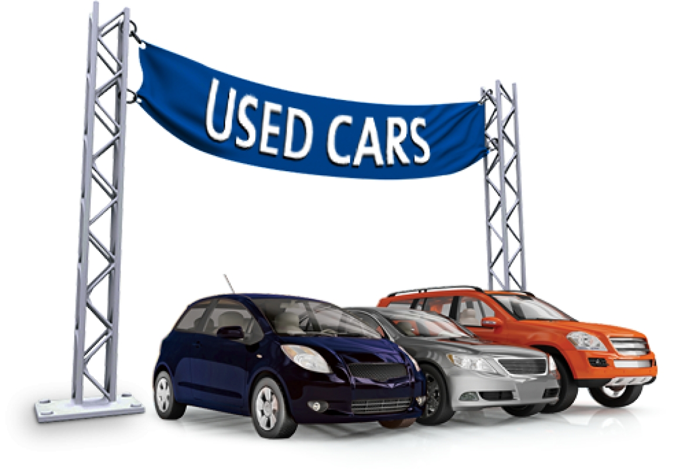

# Used-Cars-Market prices prediction: Project overview

# 

- Created a model that predicts the cars prices in the market (MAE - 14k) to help Buyers,Sellers,Investors satisfy the concern of how much is a car
realtive to it's features according to the market

- Scraped over than 12000 Ads from www.contactcars.com using python and selenium 
- Cleaned and Analyzed data to gain insights about the market.
- Engineerd features from the text of each Ad description & THe Additional features of the cars (Interior Features,Exterior Features,Multimedia Features,Safety Features) to gain more insights about each car
- Applied several models(Linear regression,Decision tree,Random Forest) to reach the best model

# Code and Resources Used

**Python Version:** 3.7

**Main Packages:** Pandas,Numpy,scikit-learn,Matplotlib,Seaborn,BeautifulSoup,Selenium

# Project stages:

1. Getting Used Cars data (Scraping data)
2. Data Cleaning
3. Features Engineering
4. Data Anlaysis
5. Applying Machine Learning Model

# Data Scraping:

I have scraped the following features from the website:

- Mobile_number
- Model_name
- SubModel_name
- Car_condition
- Kilometers_crossed
- Car_price
- Seller_City
- Model_year
- Body_type
- Transmission_type
- Motor_capacity
- Car_color
- Waranty_condition
- Car_paint
- Ad_post_date
- Interior_Features
- Exterior_Features
- Multimedia_Features
- Safety_Features
